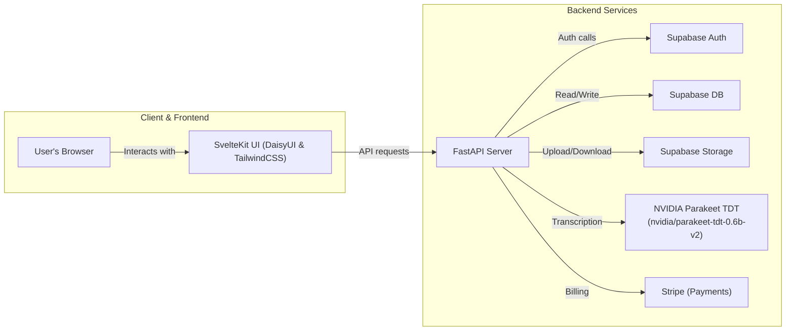

# Project Architecture

## Project Directory Structure

```text
.
├── ARCHITECTURE.md
├── AGENTS.md
├── README.md
├── resources/
├── server/
├── src/
├── static/
├── start.sh
├── svelte.config.js
├── package.json
└── vite.config.js
```

## Full Stack Architecture


## Supabase Storage File Transfer Strategy

To efficiently upload and download PPTX/audio files between the frontend and Supabase Storage while minimizing backend load and preserving security, we will employ a combination of signed URLs and backend proxy streaming:

### 1. Signed URLs (Direct Browser ↔ Supabase Storage)
- **Upload Flow**:
  1. Frontend requests a signed upload URL from the backend (FastAPI) including the target bucket/path (e.g. `presentations/temp/{user_id}/{pres_id}/...`).
  2. FastAPI uses the Supabase Python client to generate a signed upload URL with limited TTL and scoped permissions.
  3. Frontend uploads the file directly to Supabase Storage using the signed URL or the supabase-js client.
  4. On success, the frontend notifies the backend of completed staging for downstream processing.
- **Download Flow**:
  1. Frontend requests a signed download URL from FastAPI for a given storage path.
  2. FastAPI generates the signed download URL via the Supabase client.
  3. Frontend pulls the file directly from Supabase Storage using the signed URL.

### 2. Backend Proxy (FastAPI ↔ Supabase Storage)
- **Upload Proxy**:
  - Frontend POSTs files to FastAPI.
  - FastAPI streams the incoming file to Supabase Storage via the Supabase Python client or REST API, allowing server-side validation before storage.
- **Download Proxy**:
  - Frontend GETs from FastAPI endpoint.
  - FastAPI fetches the object from Supabase Storage via the Supabase client and streams content back to the client.

Both patterns keep Supabase service keys and storage policies securely on the server. The signed URL approach offloads traffic from the backend, while the proxy approach allows custom validation or transformation at upload/download time.

## MVC Architecture

- **Model**: 
  - Represents persistent data: users, presentations, slides, transcription segments.
  - Stored in Supabase DB (PostgreSQL).
  - File assets (PPTX, audio) stored in Supabase Storage.
- **View**:
  - SvelteKit frontend renders the interactive presentation UI.
  - DaisyUI + TailwindCSS components drive user interactions (clickable slides, pop‑ups, audio player).
  - Retrieves data via REST API.
- **Controller**:
  - FastAPI endpoints handle requests: authentication, file uploads, transcription jobs, data queries.
  - Orchestrates calls to Supabase Auth, Supabase Storage, NVIDIA Parakeet transcription service, billing service.
  - Maps HTTP requests to model operations and returns JSON responses.

### Database Options
- **Relational (Supabase PostgreSQL)**: strong consistency, ACID transactions, familiar schema.
- **Optional JSONB & Extensions**: flexible semi-structured data and Postgres extensions (e.g. full-text search, PostGIS).

## Remaining Tasks

**1. Supabase Setup & Configuration**  
Provision a Supabase project: create Storage buckets for file assets, configure Auth settings for user management, and set up the Postgres database with migrations. Define storage policies and database roles for secure access.

**2. Authentication & Authorization**  
Integrate Supabase Auth with FastAPI to handle user sign‑up, sign‑in, JWT token issuance, and protected routes. Update the frontend to manage auth flows and token storage using the supabase-js client.

**3. File Upload & Processing Pipelines**  
Build API endpoints for PPTX and audio uploads. Validate and stream files to Supabase Storage. Trigger transcription jobs using the NVIDIA Parakeet TDT model (nvidia/parakeet-tdt-0.6b-v2) via a background worker or GPU inference service. Store transcription results.

**4. PPTX Parsing & Mapping Logic**  
Use python-pptx (or similar) on the backend to parse slide elements (text blocks, images). Develop algorithms to align slide regions with audio transcripts and populate the model.

**5. Database Schema & Data Access Layer**  
Design and implement the DB schema (tables/collections for users, presentations, slides, segments). Create ORM or data access layer for CRUD operations. Add migrations and version control for schema.

**6. Frontend Integration & UI Enhancements**  
Replace mock data with live API calls. Implement upload UI with drag‑and‑drop. Update presentation viewer to use real slide/transcript data. Refine UX (loading states, error handling).

**7. Payment & Subscription**  
(Optional for MVP) Integrate Stripe for billing: subscription plans, payment checkout. Secure webhook endpoints and manage premium feature access.

**8. Testing, CI/CD & DevOps**  
Write unit/integration tests for backend and frontend. Configure CI pipeline for linting, building, and testing. Deploy services to your chosen platforms (e.g. Vercel for frontend, container hosting for backend). Enable monitoring dashboards and alerts.

**9. Documentation & Monitoring**  
Finalize README updates, create user guides for deployment and operations. Set up monitoring dashboards and alerts (e.g. Supabase Monitoring, Sentry). Document API specs (OpenAPI).

## Backend Design Recommendations

**1. Adopt a layered project layout**  
Define clear directories for routers, services, models, data access, and utilities (e.g. `app/routers`, `app/services`, `app/models`, `app/db`, `app/utils`).

**2. Implement core service classes**  
Create dedicated service classes (`AuthService`, `FileService`, `PPTXService`, `TranscriptionService`, `BillingService`) encapsulating business logic.

**3. Use Pydantic settings & dependency injection**  
Centralize configuration (Supabase URL & Key, database URLs, Stripe keys) via Pydantic Settings and FastAPI dependencies.

**4. Leverage background tasks or queues**  
Use FastAPI BackgroundTasks or an external task queue to offload CPU/GPU‑intensive work (PPTX parsing, transcription).

**5. Follow the Supabase Storage file transfer strategy**  
Implement both signed URL endpoints for direct uploads/downloads and proxy endpoints for server‑side validation.

**6. Design a clear, RESTful HTTP API**  
Offer CRUD endpoints for presentations/slides, plus action endpoints for uploads, transcription triggers, etc., matching the frontend’s data model.

**7. Iterate in MVP phases**  
Start with mock/static endpoints → integrate true DB & Storage → add real transcription, auth, billing → finalize with tests and CI.