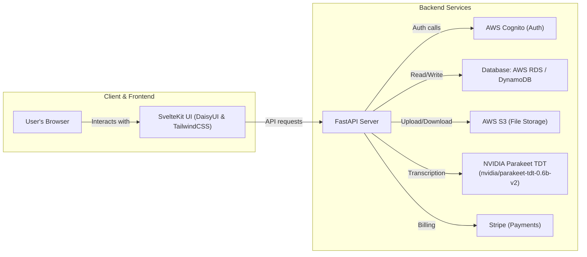

# Project Architecture

## Project Directory Structure

```text
.
├── ARCHITECTURE.md
├── AGENTS.md
├── README.md
├── resources/
├── server/
├── src/
├── static/
├── start.sh
├── svelte.config.js
├── package.json
└── vite.config.js
```

## Full Stack Architecture


## MVC Architecture

- **Model**: 
  - Represents persistent data: users, presentations, slides, transcription segments.
  - Stored in a database (e.g., PostgreSQL on AWS RDS or DynamoDB).
  - File assets (PPTX, audio) stored in AWS S3.
- **View**:
  - SvelteKit frontend renders the interactive presentation UI.
  - DaisyUI + TailwindCSS components drive user interactions (clickable slides, pop‑ups, audio player).
  - Retrieves data via REST API.
- **Controller**:
  - FastAPI endpoints handle requests: authentication, file uploads, transcription jobs, data queries.
  - Orchestrates calls to AWS Cognito, S3, NVIDIA Parakeet transcription service, billing service.
  - Maps HTTP requests to model operations and returns JSON responses.

### Database Options
- **Relational (AWS RDS PostgreSQL/MySQL)**: strong consistency, ACID transactions, familiar schema.
- **NoSQL (AWS DynamoDB)**: flexible schema, serverless scaling, pay‑per‑request.
- **Managed Graph DB (AWS Neptune)**: for advanced content relationship queries (optional).

## Remaining Tasks

**1. AWS Infrastructure & Configuration**  
Provision AWS resources: S3 buckets for file storage, Cognito user pools for auth, RDS instance or DynamoDB tables. Define IAM roles and policies for secure access.

**2. Authentication & Authorization**  
Integrate AWS Cognito with FastAPI to handle user sign‑up, sign‑in, JWT token issuance, and protected routes. Update frontend to manage auth flows and token storage.

**3. File Upload & Processing Pipelines**  
Build API endpoints for PPTX and audio uploads. Validate and stream files to S3. Trigger transcription jobs using the NVIDIA Parakeet TDT model (nvidia/parakeet-tdt-0.6b-v2) via a background worker or GPU inference service. Store transcription results.

**4. PPTX Parsing & Mapping Logic**  
Use python-pptx (or similar) on the backend to parse slide elements (text blocks, images). Develop algorithms to align slide regions with audio transcripts and populate the model.

**5. Database Schema & Data Access Layer**  
Design and implement the DB schema (tables/collections for users, presentations, slides, segments). Create ORM or data access layer for CRUD operations. Add migrations and version control for schema.

**6. Frontend Integration & UI Enhancements**  
Replace mock data with live API calls. Implement upload UI with drag‑and‑drop. Update presentation viewer to use real slide/transcript data. Refine UX (loading states, error handling).

**7. Payment & Subscription**  
(Optional for MVP) Integrate Stripe for billing: subscription plans, payment checkout. Secure webhook endpoints and manage premium feature access.

**8. Testing, CI/CD & DevOps**  
Write unit/integration tests for backend and frontend. Configure CI pipeline for linting, building, testing. Set up deployment to AWS (ECS, Lambda, or EB) and host frontend (Vercel or S3/CloudFront). Enable logging and monitoring.

**9. Documentation & Monitoring**  
Finalize README updates, create user guides for deployment and operations. Set up CloudWatch dashboards and alerts. Document API specs (OpenAPI).