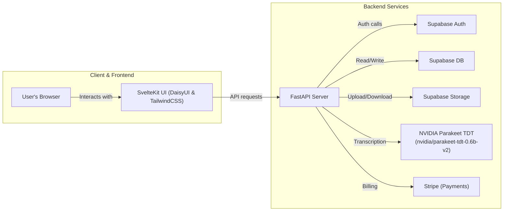

Below is a high-level proposal for how to turn your front-end and the architecture you’ve sketched out into a clean, maintainable FastAPI-based backend with clearly layered service logic. I’ve anchored each recommendation against the relevant sections of the [ARCHITECTURE.md](ARCHITECTURE.md) and (where useful) your refined [project overview](resources/refined_project_overview.md).

## 1. Recap of Goals and Constraints

### 1.1 What the app must do

From your project overview, LearnX is a SaaS that lets students upload PPTX + lecture audio, then interact with slides to see and play the exact transcription snippet tied to each slide element (bullet, image, etc.) (see [project overview](resources/refined_project_overview.md)).

### 1.2 Key architectural pillars

Your [ARCHITECTURE.md](ARCHITECTURE.md) lays out the full-stack topology and major Supabase/third-party building blocks:



## 2. High-Level Backend Structure

I recommend organizing your FastAPI codebase into four main layers, following the MVC-style guidance in your doc:

|Layer           |Responsibility                                                 |
| --------------- | -------------------------------------------------------------- |
| Controllers     | FastAPI routers & endpoints (translate HTTP ↔ service calls).   |
| Services        | Business logic (file handling, auth, transcription, billing).  |
| Data / Models   | ORM/SDK schemas, Pydantic models, repository/data-access code. |
| Infrastructure  | Supabase client setup, background tasks, config, utilities.   |

This clean separation will make each concern (e.g. “Supabase Storage file upload” vs. “DB schema” vs. “Parakeet transcription”) independently testable and maintainable.

## 3. Detailed Module Breakdown

### 3.1 Authentication Module

Goal: Integrate Supabase Auth for user sign‑up/sign‑in, JWT issuance, and token verification.

* **Controller**:
  * `POST /auth/signup` → calls `AuthService.sign_up(...)`
  * `POST /auth/login` → calls `AuthService.sign_in(...)`
  * Protected routes use a custom OAuth2 Bearer dependency that verifies Supabase JWTs.

* **Service** (`auth_service.py`):
  * Wraps the Supabase Python client (`supabase-py`), handles Auth API calls and token validation.

* **Data/Models**:
  * Pydantic schemas for request/response (e.g. `SignUpRequest`, `AuthTokens`).

**Tie‑in to your doc:**

> “Integrate Supabase Auth with FastAPI to handle user sign‑up, sign‑in, JWT token issuance, and protected routes.”

### 3.2 Supabase Storage File Handling Module

Goal: Efficient, secure upload/download of PPTX and audio with minimal backend bandwidth.

Your doc proposes two complementary patterns using Supabase Storage:

1. Signed URLs (Direct Browser ↔ Supabase Storage)
2. Backend Proxy (FastAPI ↔ Supabase Storage)

I suggest implementing both patterns as separate endpoints:

|Pattern            | Endpoint(s)                         | Notes                                           |
| ------------------ | ----------------------------------- | ----------------------------------------------- |
| Signed Upload      | `GET /files/upload-url?path=...`    | Returns a signed upload URL.                    |
| Signed Download    | `GET /files/download-url?path=...`  | Returns a signed download URL.                  |
| Upload Proxy       | `POST /files/upload-proxy`          | Streams file through FastAPI to Supabase Storage. |
| Download Proxy     | `GET /files/download-proxy?path=...`| Streams storage object back to client.          |

Centralize this logic in a `FileService`:

```python
class FileService:
    def __init__(self, supabase_client, bucket: str):
        self.storage = supabase_client.storage
        self.bucket = bucket

    def create_signed_upload_url(self, path: str, expires_in: int) -> dict: ...
    def create_signed_download_url(self, path: str, expires_in: int) -> dict: ...
    async def proxy_upload(self, path: str, fileobj: UploadFile) -> None: ...
    async def proxy_download(self, path: str) -> StreamingResponse: ...
```

### 3.3 Presentation & PPTX Parsing Module

Goal: Parse uploaded PPTX to extract slide structure, elements (text blocks, bullet points, images), then store slide metadata for interactive display.

* **Controller**:
  * `POST /presentations` → create new presentation entry, trigger parsing.
  * `GET /presentations/{id}` → fetch slide metadata & transcription pointers.

* **Service** (`pptx_service.py`):
  * Uses `python-pptx` to open PPTX → build internal slide/element model (titles, bullet points, images).
  * Persists slide metadata (e.g. slide number, element IDs) into the database via the repository layer.

* **Data/Models**:
  * ORM models / DynamoDB tables: `Presentation`, `Slide`, `SlideElement` (with fields for transcription range pointers).
  * Pydantic response models that mirror the shape your front end expects (see `mockdata.json`).

**Your doc call‑out:**

> “Use python-pptx (or similar) on the backend to parse slide elements (text blocks, images). Develop algorithms to align slide regions with audio transcripts and populate the model.”

### 3.4 Audio Transcription Module

Goal: Turn raw lecture audio into text with time‑coded segments.

* **Controller**:
  * `POST /transcription` → accept audio storage path or file reference, kick off a transcription job.

* **Service** (`transcription_service.py`):
  * Wraps NVIDIA Parakeet TDT inference (GPU microservice or call via SDK) to produce time-aligned subtitles.
  * Splits the transcription into segments and attaches them to slide element records.

* **Background Processing**:
  * This can be a FastAPI `BackgroundTask` for MVP, or a Celery/RQ job for scale.
  * On job completion, update the database with transcription segments.

**From your doc:**

> “Trigger transcription jobs using the NVIDIA Parakeet TDT model … via a background worker or GPU inference service. Store transcription results.”

### 3.5 Database & Data Access Layer

Goal: Store users, presentations, slides, elements, transcription segments reliably.

* **Recommended Tech**:
  * **SQL**: SQLAlchemy + Alembic migrations against Supabase PostgreSQL.

**Your doc’s database options:**

> - Relational (Supabase PostgreSQL)
> - Optional JSONB & Postgres extensions

* **Repository Pattern**:
  Encapsulate all DB operations behind repository classes (`PresentationRepo`, `SlideRepo`, `UserRepo`, etc.) so your service layer never talks to SQLAlchemy directly.

* **Schema Versioning**:
  Use Alembic (if SQL) or DynamoDB table versions to evolve your models safely.

### 3.6 Billing & Subscription Module (Optional MVP)

Goal: Integrate Stripe for managing user subscriptions and premium features.

* **Controller**:
  * `POST /billing/create-checkout-session` → initiate Stripe checkout.
  * `POST /billing/webhook` → secure webhook endpoint to handle subscription events.

* **Service** (`billing_service.py`):
  * Wraps the `stripe` Python SDK to create sessions, manage customers, handle webhooks.

**From your doc:**

> “Integrate Stripe for billing: subscription plans, payment checkout. Secure webhook endpoints and manage premium feature access.”

## 4. Orchestration & Remaining Tasks

Your “Remaining Tasks” section is an excellent roadmap. Ticking them off in order will guide your implementation:

| Task                                | Module                           |
| ----------------------------------- | -------------------------------- |
| Supabase Setup & Configuration      | Supabase project settings & policies |
| Auth & Supabase Auth integration    | Auth module                      |
| File Upload & Processing Pipelines  | File + PPTX + Transcription      |
| PPTX Parsing & Mapping              | PPTX module                      |
| Database Schema & Data Access Layer | Data layer + migrations          |
| Frontend Integration & UI Enhancements | Frontend → API controllers    |
| Payment & Subscription              | Billing module                   |
| Testing, CI/CD & DevOps             | Tests + GitHub Actions / CD pipelines |
| Documentation & Monitoring          | README, OpenAPI, monitoring dashboards |

## 5. Summary of Recommendations

1. **Adopt a layered project layout**
   - `app/routers/…`, `app/services/…`, `app/models/…`, `app/db/…`, `app/utils/…`.
2. **Implement core service classes**
   - `AuthService`, `FileService`, `PPTXService`, `TranscriptionService`, `BillingService`.
3. **Use Pydantic settings & dependency injection**
   - Centralize Supabase URL & Key, DB URLs, Stripe keys.
4. **Leverage background tasks or a queue**
   - Kick off CPU/GPU‑intensive jobs (parsing, transcription) without blocking.
5. **Follow the Supabase Storage file transfer strategy**
   - Offer both signed URLs for direct browser uploads and proxy endpoints for server-side validation.
6. **Design a clear RESTful API**
   - CRUD endpoints for presentations/slides and specialized action endpoints for uploads and transcription triggers.
7. **Iterate in MVP phases**
   - Start with mock/static data endpoints → integrate real DB & Storage → wire up Parakeet → add auth → add billing → finalize with tests and CI.

With this layered approach, each chunk of functionality remains focused and testable, your frontend will have exactly the endpoints it needs to replace mocks, and your team can parallelize work on auth, file handling, parsing, transcription, and billing. Let me know if you’d like a sample folder layout or starter FastAPI boilerplate to kick things off!
